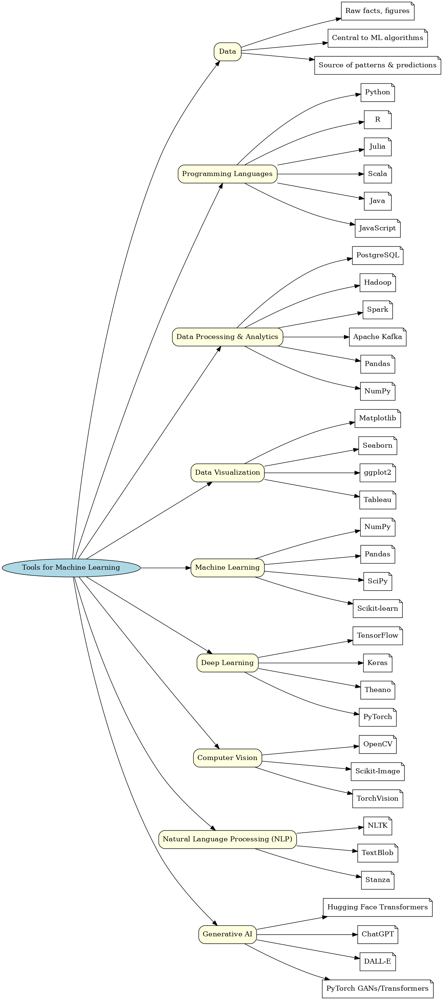

# Tools for Machine Learning - Documentation

## Data
Data is a collection of raw facts, figures, or information. It is central to ML algorithms as the source of patterns and predictions.

## Programming Languages
Popular ML languages include Python, R, Julia, Scala, Java, and JavaScript.

## Data Processing & Analytics
Tools: PostgreSQL, Hadoop, Spark, Apache Kafka, Pandas, NumPy.

## Data Visualization
Tools: Matplotlib, Seaborn, ggplot2, Tableau.

## Machine Learning
Libraries: NumPy, Pandas, SciPy, Scikit-learn.

## Deep Learning
Libraries: TensorFlow, Keras, Theano, PyTorch.

## Computer Vision
Libraries: OpenCV, Scikit-Image, TorchVision.

## Natural Language Processing (NLP)
Libraries: NLTK, TextBlob, Stanza.

## Generative AI
Libraries/Tools: Hugging Face Transformers, ChatGPT, DALL-E, PyTorch GANs/Transformers.

## Mind Map Visualization

