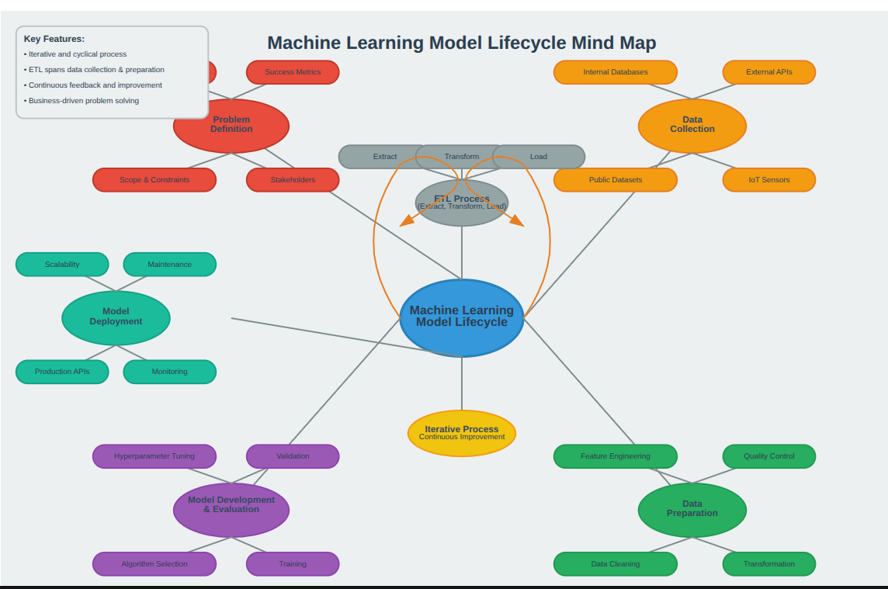

# Machine Learning Model Lifecycle

## Introduction

Machine Learning (ML) model development is a systematic process that transforms business problems into data-driven solutions. This comprehensive guide explores the complete lifecycle of machine learning products, from initial problem definition to production deployment.

## Overview of the ML Lifecycle

The Machine Learning Model Lifecycle consists of five core processes that work together to create successful ML solutions:

1. **Problem Definition**
2. **Data Collection** 
3. **Data Preparation**
4. **Model Development and Evaluation**
5. **Model Deployment**

### Key Characteristics

- **Iterative Nature**: The lifecycle is not linear; teams frequently revisit earlier stages
- **Feedback Loops**: Production issues may require returning to data collection or problem redefinition
- **Continuous Improvement**: Models evolve based on performance metrics and changing business needs

## Detailed Process Breakdown

### 1. Problem Definition
The foundation of any successful ML project begins with clearly articulating the business problem.

**Key Activities:**
- Define business objectives and success metrics
- Determine if ML is the appropriate solution
- Establish project scope and constraints
- Identify stakeholders and requirements

**Critical Questions:**
- What specific problem are we trying to solve?
- How will success be measured?
- What are the business constraints and requirements?

### 2. Data Collection
This phase involves gathering relevant data from various sources to support model training.

**Data Sources:**
- Internal databases and systems
- External APIs and third-party providers
- Web scraping and public datasets
- Sensor data and IoT devices
- User-generated content

**Considerations:**
- Data quality and reliability
- Legal and ethical compliance
- Data volume and velocity requirements
- Cost and accessibility factors

### 3. Data Preparation
Often the most time-consuming phase, data preparation transforms raw data into model-ready formats.

**Core Activities:**
- **Data Cleaning**: Handling missing values, outliers, and inconsistencies
- **Data Transformation**: Scaling, encoding, and feature engineering
- **Data Integration**: Combining data from multiple sources
- **Quality Assurance**: Validating data integrity and completeness

### 4. Model Development and Evaluation
This phase focuses on creating, training, and validating machine learning models.

**Development Process:**
- Algorithm selection and experimentation
- Feature selection and engineering
- Hyperparameter tuning and optimization
- Cross-validation and performance assessment

**Evaluation Metrics:**
- Accuracy, precision, recall, and F1-score
- Business-relevant KPIs
- Model interpretability and fairness
- Computational efficiency

### 5. Model Deployment
The final phase involves putting the trained model into production where it can generate business value.

**Deployment Strategies:**
- Batch processing for offline predictions
- Real-time APIs for online inference
- Edge deployment for low-latency applications
- Hybrid approaches combining multiple methods

**Production Considerations:**
- Scalability and performance monitoring
- Version control and rollback capabilities
- Security and compliance requirements
- Maintenance and updates

## ETL Process Deep Dive

The **Extract, Transform, and Load (ETL)** process encompasses both data collection and preparation phases.

### Extract
- Gathering data from various source systems
- Handling different data formats and protocols
- Ensuring data lineage and traceability

### Transform
- Cleaning and standardizing data formats
- Applying business rules and logic
- Creating derived features and aggregations

### Load
- Storing processed data in target systems
- Optimizing for query performance
- Implementing data governance policies

## The Iterative Nature of ML Lifecycle

### Why Iteration Matters

- **Model Performance Issues**: Poor accuracy or bias in production
- **Data Quality Problems**: Discovery of data inconsistencies or gaps
- **Changing Requirements**: Evolving business needs or objectives
- **Technical Constraints**: Infrastructure limitations or scalability issues

### Feedback Mechanisms

- **Production Monitoring**: Tracking model performance in real-world scenarios
- **A/B Testing**: Comparing model versions and approaches
- **User Feedback**: Incorporating stakeholder input and user experience data
- **Business Metrics**: Measuring impact on key performance indicators

## Best Practices and Recommendations

### 1. Start with Clear Problem Definition
- Invest time upfront in understanding business requirements
- Ensure alignment between technical and business objectives
- Define success criteria before beginning development

### 2. Prioritize Data Quality
- Implement robust data validation processes
- Document data sources and transformations
- Establish data governance frameworks

### 3. Embrace Experimentation
- Use systematic approaches to model selection
- Implement proper version control for code and data
- Document experiments and results

### 4. Plan for Production
- Consider deployment constraints early in the process
- Build monitoring and alerting capabilities
- Prepare for model maintenance and updates

### 5. Foster Collaboration
- Engage stakeholders throughout the process
- Maintain clear communication channels
- Document processes and decisions

## Real-World Application Example

**Beauty Product Recommendation System**

A machine learning solution designed to enhance user experience in beauty product shopping demonstrates the complete lifecycle:

1. **Problem**: Improve product discovery and customer satisfaction
2. **Data Collection**: User behavior, product catalogs, reviews, demographics
3. **Data Preparation**: Feature engineering, user segmentation, content processing
4. **Model Development**: Collaborative filtering, content-based recommendations, hybrid approaches
5. **Deployment**: Real-time recommendation APIs integrated with e-commerce platform

## Conclusion

The Machine Learning Model Lifecycle provides a structured framework for developing successful ML solutions. While the process appears linear, its iterative nature requires flexibility and continuous improvement. Success depends on clear problem definition, high-quality data, rigorous model development, and thoughtful deployment strategies.

Understanding this lifecycle enables teams to:
- Plan projects more effectively
- Anticipate common challenges and bottlenecks
- Make informed decisions about resource allocation
- Build robust, maintainable ML systems

## Mind Map Visualization
