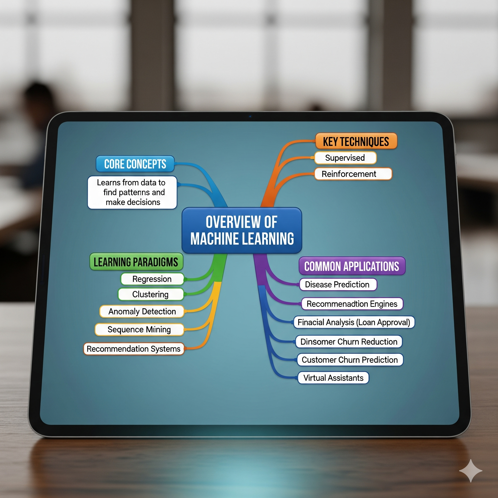

## Overview of Machine Learning

* **Central Topic: Overview of Machine Learning**
    * **1. What is Machine Learning?**
        * **Relation to AI:** It is a subset of Artificial Intelligence (AI).
            * **AI:** A general field that makes computers seem intelligent by simulating human cognitive abilities.
            * **Deep Learning:** A subset of ML using multi-layered neural networks that automatically extract features.
        * **Core Definition:** Teaches computers to learn from data, identify patterns, and make decisions without explicit instructions.
    * **2. How Models Learn (Learning Paradigms)**
        * **Supervised Learning:** Trains on labeled data to make predictions on new data.
        * **Unsupervised Learning:** Works without labels to find patterns in data.
        * **Semi-supervised Learning:** Trains on a small set of labeled data and iteratively adds its own high-confidence labels.
        * **Reinforcement Learning:** An agent learns by interacting with an environment and receiving feedback.
    * **3. Machine Learning Techniques**
        * **Classification:** Predicts a class or category (e.g., malignant/benign cell).
        * **Regression:** Predicts a continuous value (e.g., house price).
        * **Clustering:** Groups similar cases (e.g., customer segmentation).
        * **Association:** Finds co-occurring items or events (e.g., market basket analysis).
        * **Anomaly Detection:** Discovers unusual cases (e.g., fraud detection).
        * **Sequence Mining:** Predicts the next event in a sequence (e.g., clickstream analysis).
        * **Dimension Reduction:** Reduces the number of features in data.
        * **Recommendation Systems:** Recommends items based on users with similar tastes.
    * **4. Applications of Machine Learning**
        * **Disease Prediction:** Identifying if a human cell sample is benign or malignant.
        * **Consumer Behavior Analysis:**
            * Recommending products/content (Amazon, Netflix).
            * Predicting customer churn for telecom companies.
        * **Financial Services:** Predicting loan default probability for banks.
        * **Image Recognition:** Differentiating between cats and dogs in images.
        * **Other Common Uses:** Virtual assistants (chatbots), face recognition, and computer games.

---

## Overview Mind Map

* **Core Concepts**
    * Subset of AI 
    * Learns from data to find patterns and make decisions 
* **Learning Paradigms**
    * Supervised
    * Unsupervised 
    * Semi-supervised 
    * Reinforcement 
* **Key Techniques** 
    * Classification
    * Regression
    * Clustering
    * Association
    * Anomaly Detection
    * Sequence Mining
    * Dimension Reduction
    * Recommendation Systems
* **Common Applications**
    * Disease Prediction
    * Recommendation Engines
    * Financial Analysis (Loan Approval)
    * Image Recognition
    * Customer Churn Prediction
    * Virtual Assistants

## Mind Map Visualization
